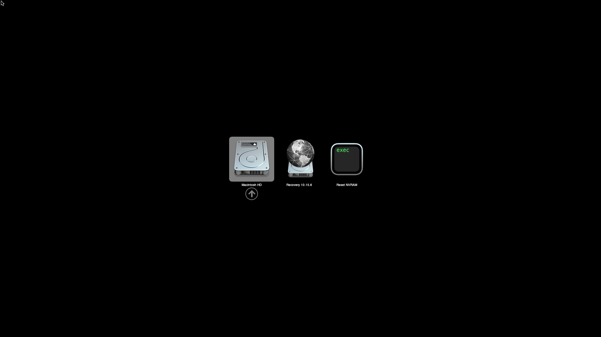
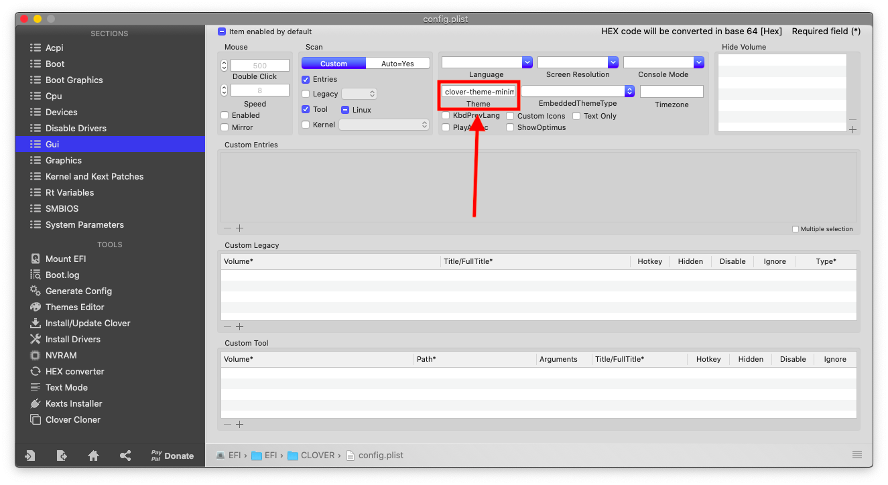

# Clover OSS Theme

Mac-style theme for Clover (originally by [lisai9093](https://github.com/lisai9093)).

# Installation
- Clover
Copy-and-paste the theme to EFI/CLOVER/themes, located on the EFI system partition. then, edit your `Clover's` `config.plist` to select the theme.

-OpenCore
Copy-and-paste the theme to EFI/OC, located on the EFI system partition. then, edit your `OpenCore's` `config.plist` to select the theme.
# Credits
- [Apple](https://www.apple.com) for macOS.
- [al3xtjames](https://github.com/al3xtjames) for the original theme.
- [blackosx](https://github.com/blackosx/OpenCanopyIcons) for OpenCanopyIcons theme.
- The original theme by [lisai9093](https://github.com/lisai9093).
- The Yosemite-style Windows volume icon is from [here](http://atopsy.deviantart.com/art/Boot-Camp-Assistant-for-OS-X-Yosemite-Re-Upload-500410985).
- And anyone else that helped to develop and improve hackintoshing.

